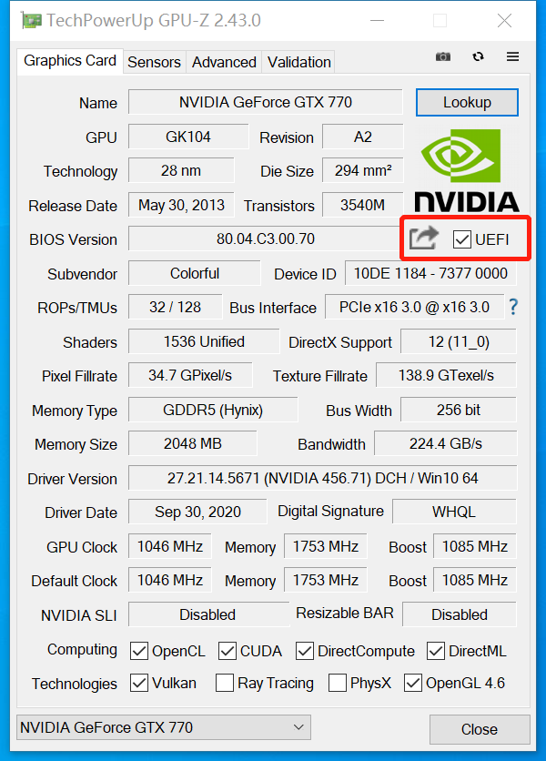
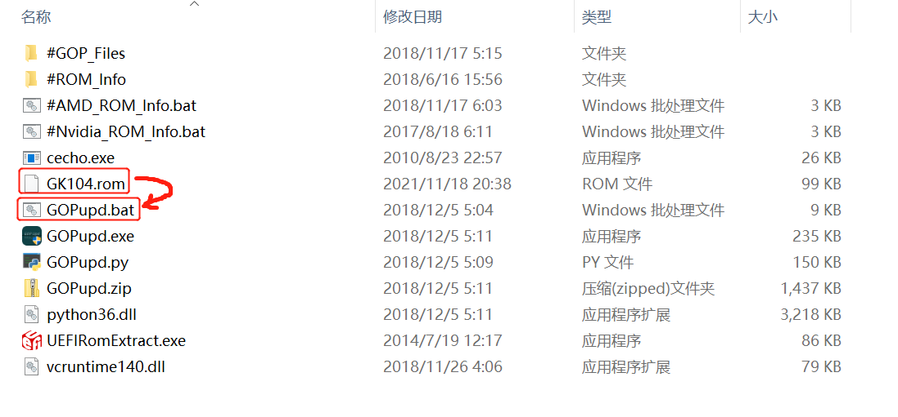
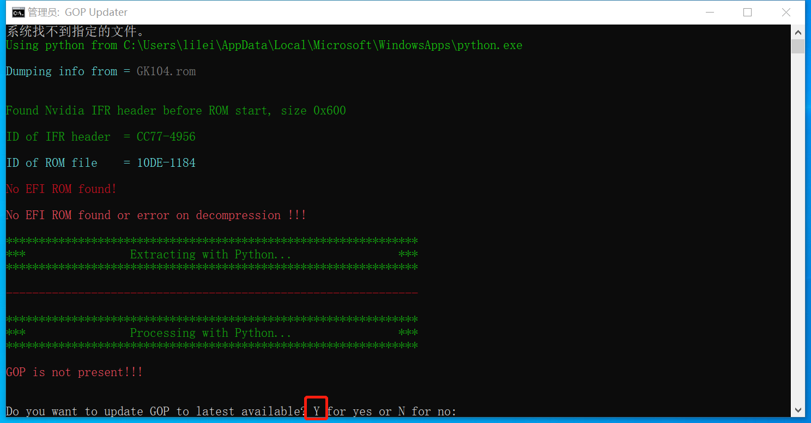
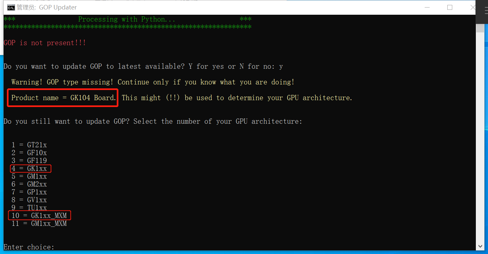
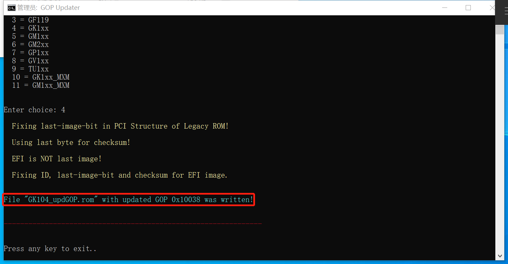
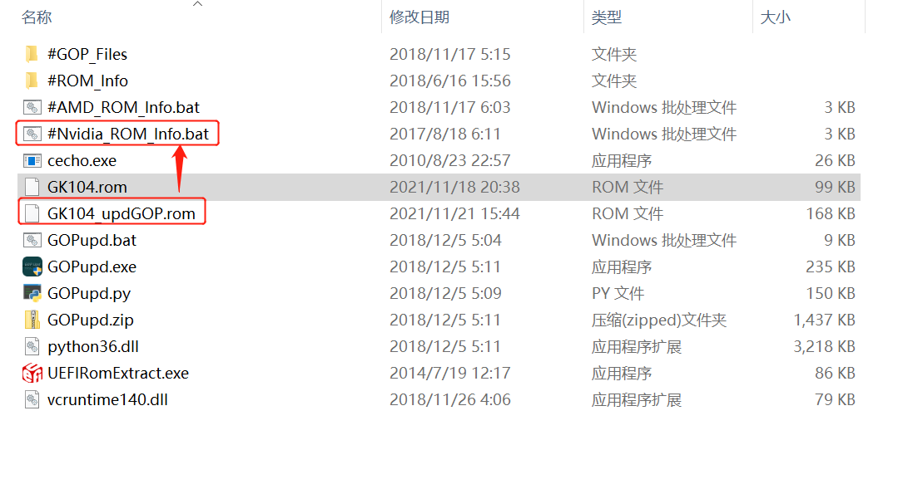
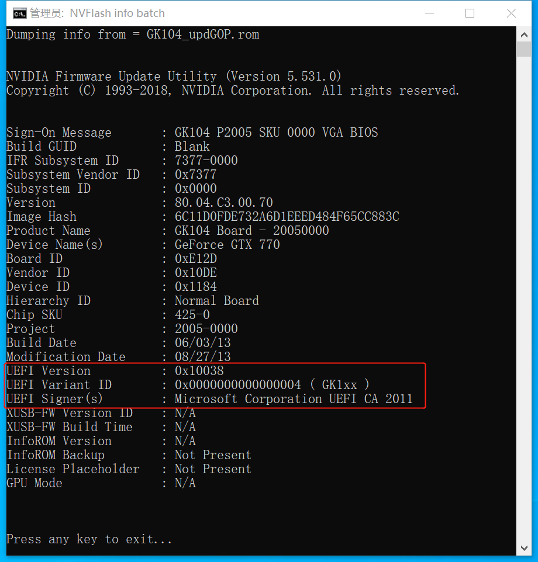

怎么给显卡刷vBIOS支持UEFI启动 
---

> 刷Bios有风险，任何损坏请自行承担责任！

## 如何查看自己的显卡是否支持UEFI

入下图红框中的UEFI前面有个勾说明显卡支持UEFI启动。

## 准备工作
先下载如下软件，N卡A卡按需选择刷机软件。
- [GPU-Z](https://www.techpowerup.com/download/techpowerup-gpu-z/)
- [AMD and Nvidia GOP update]()
- [NVIDIA NVFlash](https://www.techpowerup.com/download/nvidia-nvflash/)
- [AMD VBFlash/ATI ATIFlash](https://www.techpowerup.com/download/ati-atiflash/)

安装python3环境，并使用pip安装colorama扩展 
> pip install colorama

## 开始

这里以我的GTX770（N卡）为例：

### ①备份显卡BIOS固件
打开GPU-Z点击UEFI左边的转发小图标，即可备份显卡BIOS。备份时会暂时禁用显卡，出现短暂黑屏，恢复后会弹窗选择BIOS保存路径。

或者从[这里](https://www.techpowerup.com/vgabios/)下载对应显卡型号的BIOS。

### ②制作UEFI的BIOS固件
把备份下来的BIOS文件，放到 AMD and Nvidia GOP update 文件夹里面，并且把备份出来的 BIOS文件 拖动 到 GOPupd.bat 文件上，如图：

如图操作 Product name = GK104 Board提示了显卡GPU核心型号，按照自己的型号选择。这里我的GK104有两个选择，10:GK1xx_MXM是移动平台的显卡，如果是笔记本的显卡选择这一项。如果台式机选择4:GK1xx。

然后提示 File 'GK104_updGOP.rom' with updated GOP 0x10038 was written!，表示就是在BIOS里面添加UEFI了。此时GK104_updGOP.rom就是制作好的添加了UEFI的BIOS固件了。

### ③验证新BIOS文件是否支持UEFI
可以验证一下 GK104_updGOP.rom 是否添加上 UEFI了，如下图将新制作的BIOS文件拖到#Nvidia_ROM_info.bat文件上。

如果看到 UEFI VERSION信息表示BIOS已经带UEFI了！

### ④刷入显卡BIOS固件
6.把生成的 BIOS 文件，复制到 nvflash 文件夹里面，然后 开始菜单 → 命令提示符 → **右键以管理员身份运行**，cd到nvflash文件夹目录输入命令 `nvflash -6 GK104_updGOP.rom` (替换成自己显卡bios的文件名)。

然后 CMD 先不要按回车，窗口也不要关闭！到设备管理器里面看下显卡是否处于禁用状态。未禁用的话禁用一下显卡，接着回到CMD窗口，回车，按Y，正常的话出现滴的一声，等刷入进度条读完就成功了。

## 完成
至此，显卡固件已经更新成功，重启之后打开GPU-Z验证是否已经支持UEFI启动了。如果系统磁盘是使用GPT格式安装并且显卡也已经支持UEFI，就可以进入主板BIOS关闭GSM兼容模块，使用纯UEFI引导系统了。